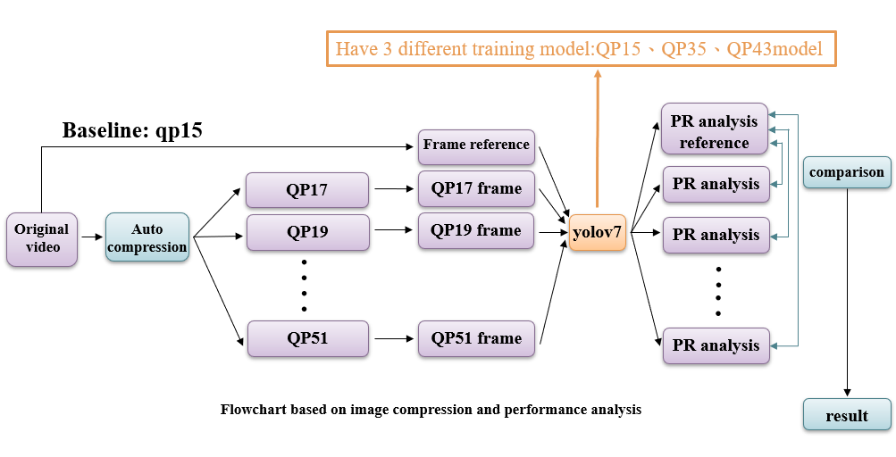
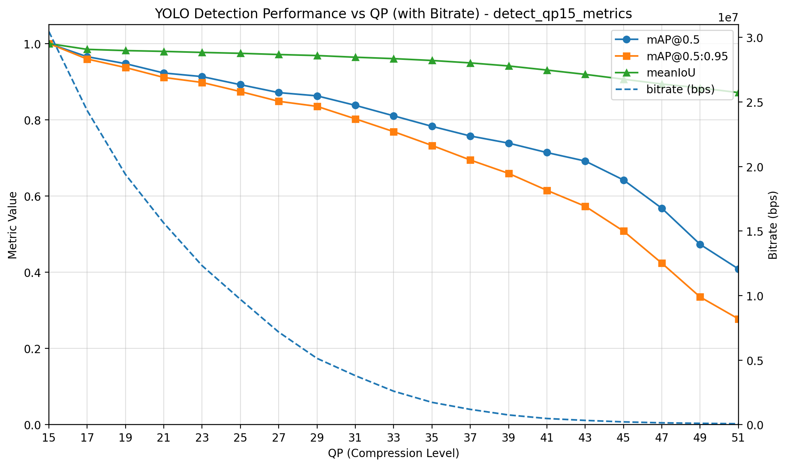
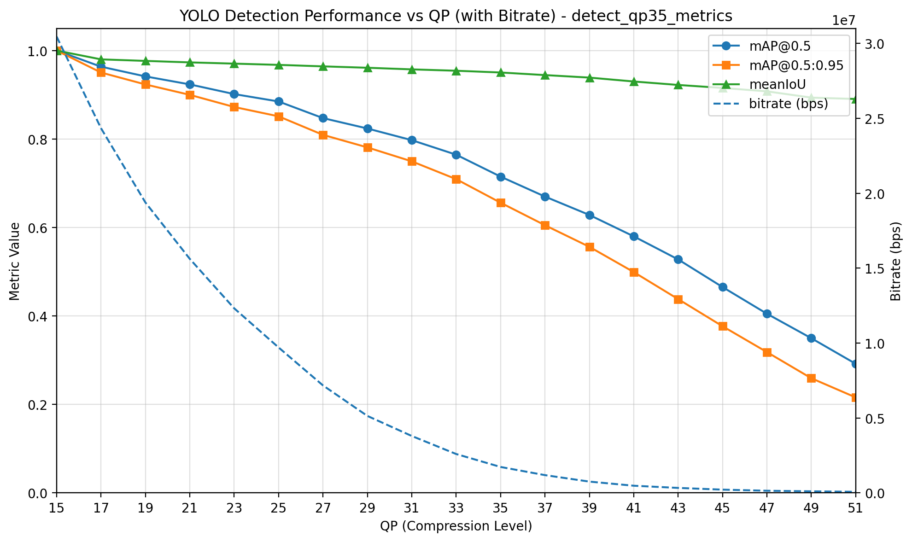
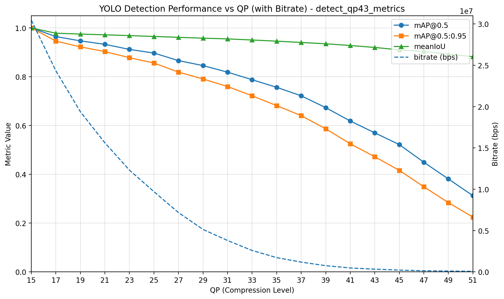
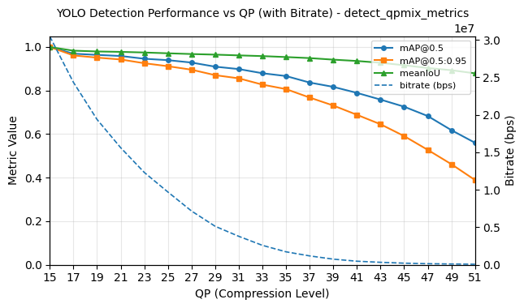
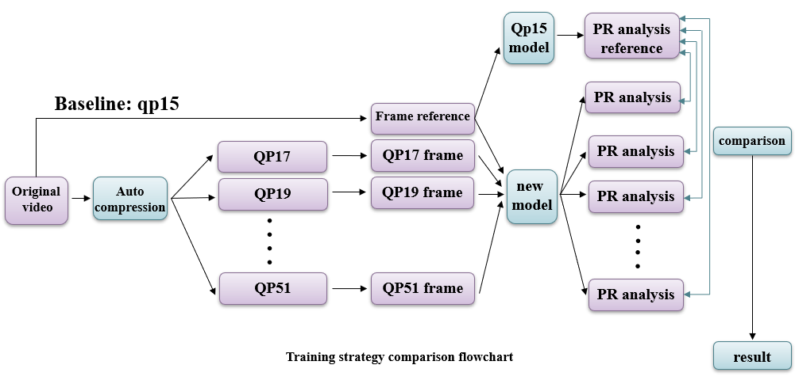
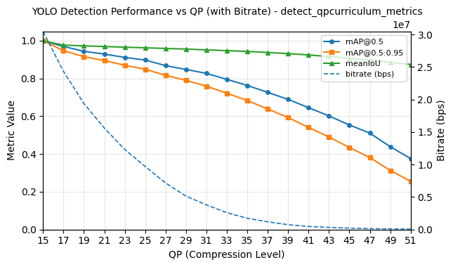

# Compression-Robust YOLOv7 for Smart Aquaculture Monitoring

## Overview

This project investigates how video compression affects YOLOv7 object detection performance in smart aquaculture monitoring systems.

The objective is to determine the maximum acceptable compression level that reduces bandwidth and storage requirements while maintaining reliable shrimp detection accuracy.

In addition to evaluating compression effects, this work explores different training strategies for improving robustness under severe compression, including Fixed-QP Training, Mixed-QP Training, and Curriculum Learning.

---

## Highlights

- Evaluated YOLOv7 under 22 compression levels (QP15–QP51)
- Compared three Fixed-QP training models
- Developed Mixed-QP training strategy
- Proposed Curriculum Learning over compression levels
- Achieved nearly 4× bandwidth reduction
- Improved robustness under severe compression conditions

---

# Research Motivation

Large-scale shrimp farms continuously generate video streams for:

- Shrimp counting
- Behavior monitoring
- Feeding analysis
- Long-term recording

Challenges:

- Limited internet bandwidth
- Large storage requirements
- High transmission costs

Video compression provides an effective solution, but excessive compression may remove important visual features required for object detection.

This project investigates the trade-off between:

- Detection Accuracy
- Bandwidth Consumption
- Storage Efficiency

---

# Experimental Pipeline

The overall workflow of the compression-performance evaluation.



Workflow:

1. Original videos are compressed into different QP levels.
2. Frames are extracted from compressed videos.
3. YOLOv7 performs object detection.
4. Detection performance is evaluated using mAP and IoU.
5. Results are compared across compression levels.

---

# Dataset

| Split | Images |
|---------|---------|
| Training | 509 |
| Validation | 219 |
| Testing | 116 |

Target Class:

- Shrimp

---

# Compression Settings

Compression is controlled using H.264 Quantization Parameter (QP).

| QP Range | Compression Level |
|-----------|------------------|
| QP15 | Very High Quality |
| QP25 | High Quality |
| QP35 | Medium Compression |
| QP43 | Heavy Compression |
| QP51 | Maximum Compression |

A total of 22 QP levels were evaluated.

---

# Baseline 1: Fixed-QP Training

Three independent YOLOv7 models were trained.

| Model | Training Data |
|---------|---------|
| QP15 Model | High-quality images |
| QP35 Model | Medium-compressed images |
| QP43 Model | Heavily-compressed images |

---

## QP15 Model



Observations:

- Highest overall mAP
- Best performance on clear images
- Significant performance degradation after QP43

---

## QP35 Model



Observations:

- Better robustness against compression artifacts
- More stable than QP15 under high compression
- Slightly worse on low-QP images

---

## QP43 Model



Observations:

- Most tolerant to severe compression
- Stable performance under high QP
- Lower accuracy on clear images

---

## Key Observation

Although the QP15 model achieves the highest overall accuracy, QP35 and QP43 models show better robustness under severe compression.

This raises an important question:

> Can a model learn both clear-image features and compressed-image features simultaneously?

---

# Baseline 2: Mixed-QP Training

To improve robustness, multiple compression levels are introduced during training.

Training samples are randomly selected from:

```text
QP15 ~ QP51
```

---

## Mixed-QP Result



Advantages:

- Better generalization across QP levels
- Improved robustness against compression artifacts

Limitation:

- High-QP samples are introduced too early
- Optimization becomes more difficult
- Training may converge to suboptimal solutions

---

# Proposed Method: Curriculum Learning over QP

Instead of exposing the model to all compression levels from the beginning, training difficulty is gradually increased.

The model first learns clear visual features and progressively adapts to more difficult compressed images.

---

## Why Curriculum Learning?

### Optimization Stability

High-QP images contain:

- Blur
- Blocking artifacts
- Loss of texture information

Introducing them too early may cause unstable gradients and poor convergence.

### Feature Learning Order

Low-QP images preserve:

- Shape information
- Texture details
- Object boundaries

These features should be learned before introducing severely compressed samples.

---

## Curriculum Schedule

### Stage 1 (Epoch 1–99)

```text
90% QP15–20
10% QP21–25
```

### Stage 2 (Epoch 100–199)

```text
60% QP26–35
30% QP15–25
10% QP36–40
```

### Stage 3 (Epoch 200–300)

```text
60% QP41–45
30% QP15–40
10% QP46–51
```

---

## Curriculum Workflow



The proposed model is evaluated against the QP15 baseline using identical compressed datasets.

---

## Curriculum Learning Result



Results show:

- Higher mAP@0.5
- Higher mAP@0.5:0.95
- Higher Mean IoU
- Better robustness at high compression levels

compared with Mixed-QP training.

---

# Evaluation Metrics

## IoU

Intersection over Union

Measures overlap between:

- Ground Truth Bounding Box
- Predicted Bounding Box

Higher IoU indicates more accurate localization.

---

## AP

Average Precision

Area under the Precision–Recall curve.

---

## mAP@0.5

Average AP using:

```text
IoU = 0.5
```

---

## mAP@0.5:0.95

Average AP across multiple IoU thresholds.

Provides a more comprehensive evaluation of detection quality.

---

# Main Findings

### Compression Threshold

Detection performance remains relatively stable under moderate compression.

A noticeable decline appears after:

```text
QP43
```

---

### Bandwidth Reduction

The proposed framework achieves approximately:

```text
4× bandwidth reduction
```

while maintaining acceptable detection performance.

---

### Training Strategy Comparison

Performance ranking:

```text
Curriculum Learning
        ↓
Mixed-QP Training
        ↓
Fixed-QP Training
```

under severe compression conditions.

---

# Technologies

- Python
- PyTorch
- YOLOv7
- OpenCV
- FFmpeg
- Linux

---

# Future Work

- Reverse Curriculum Learning (Hard → Easy)
- CRF-based compression evaluation
- Larger datasets
- Real-world deployment in shrimp farms
- Adaptive compression-aware object detection

---

# Author

Yu Ying Lan

Department of Computer Science and Engineering

National Sun Yat-Sen University

Embedded Systems Laboratory
